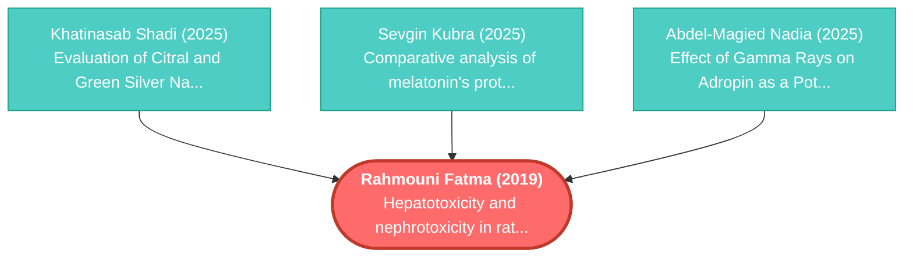

# Citation Tree Test

```mermaid
graph TD
    %% Citation Tree: Hepatotoxicity and nephrotoxicity in rats induced ...

    pmid_30676168(["<b>Rahmouni Fatma (2019)</b><br/>Hepatotoxicity and nephrotoxicity in rat..."])
    pmid_41104376["Khatinasab Shadi (2025)<br/>Evaluation of Citral and Green Silver Na..."]
    pmid_40781284["Sevgin Kubra (2025)<br/>Comparative analysis of melatonin's prot..."]
    pmid_40351536["Abdel-Magied Nadia (2025)<br/>Effect of Gamma Rays on Adropin as a Pot..."]

    pmid_41104376 --> pmid_30676168
    pmid_40781284 --> pmid_30676168
    pmid_40351536 --> pmid_30676168

    %% Styling
    style pmid_30676168 fill:#ff6b6b,stroke:#c0392b,stroke-width:3px,color:#fff
    style pmid_41104376 fill:#4ecdc4,stroke:#16a085,color:#fff
    style pmid_40781284 fill:#4ecdc4,stroke:#16a085,color:#fff
    style pmid_40351536 fill:#4ecdc4,stroke:#16a085,color:#fff
```
